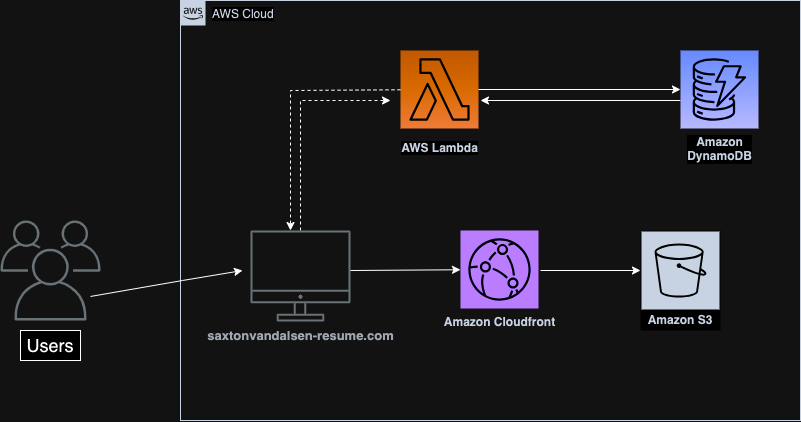

# AWS Serverless CI/CD Portfolio Website (Frontend)

## Project Overview

This project showcases a fully serverless portfolio website, leveraging modern cloud infrastructure to enable seamless CI/CD workflows for both frontend and backend components. I hosted a static website on AWS S3 with a global distribution through CloudFront, ensuring high availability and performance. The backend architecture, maintained in a seperate repository listed below, is managed using Infrastructure as Code (IaC) principles with Terraform, automating resource provisioning and configuration.

## Architecture



## Tools, Technologies, and Learnings

### Frontend Development
* **HTML, CSS, and JavaScript**: Integrated a Bootstrap HTML and CSS template, customizing it as need to incorporate Javascript funcitonality.
* **JavaScript (API-Driven Counter)**: Fetches the visitor count from my DynamoDB table via my Lambda function. The count is displayed through my html file, making it dynamic and up-to-date with every page load.

### Infrastructure
* **AWS S3**: Hosted the static website content.
* **AWS Lambda**: Management of my serverless function URL.
* **AWS DynamoDB**: Stores my webpages visitor count data.
* **AWS CloudFront & ACM**: Delivered content with low latency, maintained HTTPS settings, and the management of my custom domain name.

### DevOps Practices
* **Infrastructure as Code (IaC)**: Used Terraform to automate the provisioning of my AWS resources.
* **Continuous Integration/Continuous Deployment (CI/CD)**: Set up GitHub Actions for automated deployment and testing.

### AWS CLI, SDK, and Security
* **IAM Roles and Policies**: Implemented best practices for AWS Identity and Access Management, ensuring secure access control.
* **Environment Variables and Secret Keys**: Secured sensitive information using environment variables to protect against unauthorized access.
* **AWS CLI and SDKs**: Gained hands-on experience with AWS Command Line Interface for IAM role configuration and leveraged AWS SDKs for programmatic interactions with AWS services.
* **Version Control**: Utilized Git and GitHub for version control, ensuring efficient code management.


### Visitor Counter API Integration
* Implemented a dynamic visitor counter on my S3-hosted static website using AWS Lambda, DynamoDB, Python, and Javascript.
* Configured Lambda with the function URL setting to create a lightweight API, with the Lambda function acting as an intermediary between the website and DynamoDB.
* Each page visit triggers the Lambda function via its HTTPS endpoint, which retrieves, increments, and updates the view count in DynamoDB, ensuring a scalable and real-time visitor tracking system.
* Javascript then fetches the visitor count and displays it on the webpage.
  - Snippet of the Python code in my Lambda function utilizing boto3 library:

```python
import json
import boto3

dynamodb = boto3.resource('dynamodb')
table = dynamodb.Table('cloudresumechallenge-db')

def lambda_handler(event, context):
    response = table.get_item(Key={
        'id':'1'
    })
    views = response['Item']['views']
    views = views + 1
    print(views)
    response = table.put_item(Item={
        'id':'1',
        'views': views
    })
    
    return views
```

### Backend Repository
* Established a dedicated [backend repository](https://github.com/saxtonvandalsen/backend-iac-cloudresume) to manage the backend configuration. This setup allows for automated updates to Terraform and AWS services upon pushing changes.
